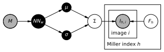

# Careless 
Merging crystallography data without much physics. 


[](https://codecov.io/gh/rs-station/careless)
[](https://pypi.org/project/careless/)
[](https://doi.org/10.1101/2021.01.05.425510)

## Installation
As described in the [TensorFlow docs](https://www.tensorflow.org/install/pip#step-by-step_instructions), it is best practice to install `careless` in a fresh [anaconda](https://www.anaconda.com/products/distribution) environment to avoid conflicts with previously installed dependencies. 

Create a new environment and install `careless` using the following commands.
```bash
conda create -yn careless python
conda activate careless
pip install --upgrade pip
pip install careless
```

## Installation with GPU Support
Careless supports GPU acceleration on NVIDIA GPUs through the CUDA library. We strongly encourage users to take advantage of this feature. To streamline installation, we maintain a script which installs careless with CUDA support. The following section will guide you through installing careless for the GPU. 

1) **Install the NVIDIA driver** for your accelerator card. In most high performance computing scenarios, this driver should be pre-installed. If it is not, we suggest you contact your system administrator as installation will require elevated privileges. 

    You may check if the driver is functional by typing `nvidia-smi`. If it is working properly you will see output like the following,

        Thu Jun 13 13:01:32 2024                                                                       
        +-----------------------------------------------------------------------------------------+    
        | NVIDIA-SMI 550.54.15              Driver Version: 550.54.15      CUDA Version: 12.4     |    
        |-----------------------------------------+------------------------+----------------------+    
        | GPU  Name                 Persistence-M | Bus-Id          Disp.A | Volatile Uncorr. ECC |    
        | Fan  Temp   Perf          Pwr:Usage/Cap |           Memory-Usage | GPU-Util  Compute M. |    
        |                                         |                        |               MIG M. |    
        |=========================================+========================+======================|    
        |   0  Tesla V100S-PCIE-32GB          On  |   00000000:86:00.0 Off |                    0 |    
        | N/A   32C    P0             25W /  250W |       0MiB /  32768MiB |      0%      Default |    
        |                                         |                        |                  N/A |    
        +-----------------------------------------+------------------------+----------------------+    
                                                                                                       
        +-----------------------------------------------------------------------------------------+    
        | Processes:                                                                              |    
        |  GPU   GI   CI        PID   Type   Process name                              GPU Memory |    
        |        ID   ID                                                               Usage      |    
        |=========================================================================================|    
        |  No running processes found                                                             |    
        +-----------------------------------------------------------------------------------------+    
    A faulty driver will give an error message:

        NVIDIA-SMI has failed because it couldn't communicate with the NVIDIA driver. Make sure that the latest NVIDIA driver is installed and running. 
    If the driver isn't installed, you will see:

        nvidia-smi: command not found
2) **Install Anaconda**. Once you have confirmed the NIVIDIA driver is available, proceed to install the Anaconda python distribution by following the instructions [here](https://docs.anaconda.com/free/anaconda/install/). Before proceeding, make sure you activate your conda base environment. For typical installations, this should normally happen by opening a new login shell. Alternatively, you may directly source the `conda.sh` in your Anaconda install directory. 
3) **Install careless** and associated dependencies by running the following from your base conda environment: 

        source <(curl -s https://raw.githubusercontent.com/rs-station/careless/main/install-cuda.sh)
    This will automatically create a new conda environment named careless.

Careless is now installed in its own environment. Whenever you want to run careless, you must first activate the careless conda environment by issuing `conda activate careless`. After the installation is finished, the script will test GPU availability by running `careless devices`. If the installation was successful and your node has a GPU, it will appare in the output:

        (careless) user@computer:~$ careless devices
        Careless version 0.4.3
        ###############################################
        # TensorFlow can access the following devices #
        ###############################################
         - CPU: /physical_device:CPU:0
         - GPU: /physical_device:GPU:0


## Dependencies

`careless` is likely to run on any operating system and python version which is compatible with TensorFlow. 
`careless` uses mostly tools from the conventional scientific python stack plus
 - optimization routines from [TensorFlow](https://www.tensorflow.org/)
 - statistical distributions from [Tensorflow-Probability](https://www.tensorflow.org/probability)
 - crystallographic computing resources from 
    - [ReciprocalSpaceship](https://rs-station.github.io/reciprocalspaceship/)
    - [GEMMI](https://gemmi.readthedocs.io/en/latest/)


`careless` does not require but may take advantage of various accelator cards supported by TensorFlow.

## Get Help
For help with command line arguments, type `careless mono --help` for monochromatic or `careless poly --help` for Laue processing options. 

For usage examples and data from the [preprint](https://doi.org/10.1101/2021.01.05.425510), check out [careless-examples](https://github.com/rs-station/careless-examples)

Still confused? File an [issue](https://github.com/rs-station/careless/issues/new/choose)! Issues help us improve our code base and leave a public record for other users. 


## Core Model



`careless` uses approximate Bayesian inference to merge X-ray diffraction data. 
The model which is implemented in `careless` tries to scale individual reflection observations such that they become consistent with a set of prior beliefs.
During optimization of a model, `careless` trades off between consistency of the merged structure factor amplitudes with the data and consistency with the priors.
In essence, the optimizer tries to strike a compromise which maximizes the likelihood of the observed data while not straying far from the prior distributions. 

The implementation breaks the model down into 4 types of objects. 

### Variational Merging Model
The `VariationalMergingModel` is central object which houses the estimates of the merged structure factors.
In `careless` merged structure factors are represented by truncated normal distributions which have support on (0, ∞).
According to French and Wilson<sup>[2](#frenchwilson)</sup> this is the appropriate parameterization for acentric reflections which are by far the majority in most space groups.
These distributions are stored in the `VariationalMergingModel.surrogate_posterior` attribute. 
They serve as a parametric approximation of the true posterior which cannot easily be calculated. 
It has utility methods for training the model.
It contains an instance of each of the other objects. 
During optimization, the loss function is constructed by sampling values for the merged structure factors and scales these are combined with the prior and likelihood to compute the `Evidence Lower BOund` or (`ELBO`)
Gradiennt ascent is used to maximize the `ELBO`.

### Priors
The simplest prior which `careless` implements are the popular priors<sup>[1](#wilson)</sup> derived by A. J. C. Wilson from the random atom model. 
This is a relatively weak prior, but it is sufficient in practice for many types of crystallographic data. 
`careless` will include support for reference and multivariate priors in future releases. 

### Likelihoods
The quality of the current structure factor estimates during optimization is judged by a likelihood function. 
These are symmetric probability distributions centered at the observed reflection observation. 
`careless` includes normally-distributed and robust, t-distributed likelihoods. 

### Scaling Models
Right now the only model which `careless` explicitly implements is a sequential neural network model. 
This model takes reflection metadata as input and outputs a gaussian distribution of likely scale values for each reflection.

Special metadata keys for scaling. 
`careless` will parse any existing metadata keys in the input Mtz(s). 
During configuration some new metadata keys will be populated that are useful in many instances. 
 - <b>dHKL</b> : The inverse square of the reflection resolution. Supplying this key is a convenient way to parameterize isotropic scaling.
 - <b>file_id</b> : An integer ID unique to each input Mtz. 
 - <b>image_id</b> : An integer ID unique to each image across all input Mtzs. 
 - <b>{H,K,L}obs</b> : Internally, `careless` refers to the original miller indices from indexing as `Hobs`, `Kobs`, and `Lobs`. Supplying these three keys is the typical method to enable anisotropic scaling. 


### Considerations when choosing metadata. 
 - <b>Polarization correction</b> : Careless does not apply a specific polarization correction. 
   In order to be sure the model accounts for polarization, it is important to supply the x,y 
   coordinates of each reflection observation. 
 - <b>Isotropic scaling</b> : This is easily accounted for by supplying the 'dHKL' metadata key.
 - <b>Interleaved rotation series</b> : Most properly formatted Mtzs have a "Batch" column which contains a unique id for each image. 
   Importantly, these are usually in order. If you have time resolved data with multiple timepoints per angle, you may
   want to use the "Batch" key in conjunction with the "file_id" key. This way images from the same rotation angle will
   be constrained to scale more similarly. 
 - <b>Multi crystal scaling</b> : For scaling multiple crystals, it is best if image identifiers in the metadata do not overlap. Therefore, use the 'image_id' key. 

<a name="wilson">1</a>: Wilson, A. J. C. “The Probability Distribution of X-Ray Intensities.” Acta Crystallographica 2, no. 5 (October 2, 1949): 318–21. https://doi.org/10.1107/S0365110X49000813.

<a name="frenchwilson">2</a>: French, S., and K. Wilson. “On the Treatment of Negative Intensity Observations.” Acta Crystallographica Section A: Crystal Physics, Diffraction, Theoretical and General Crystallography 34, no. 4 (July 1, 1978): 517–25. https://doi.org/10.1107/S0567739478001114.

