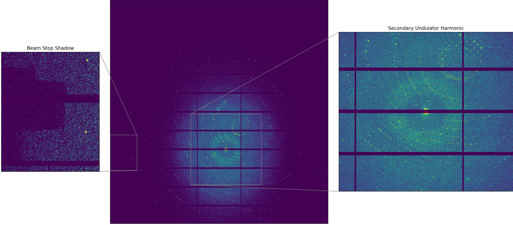
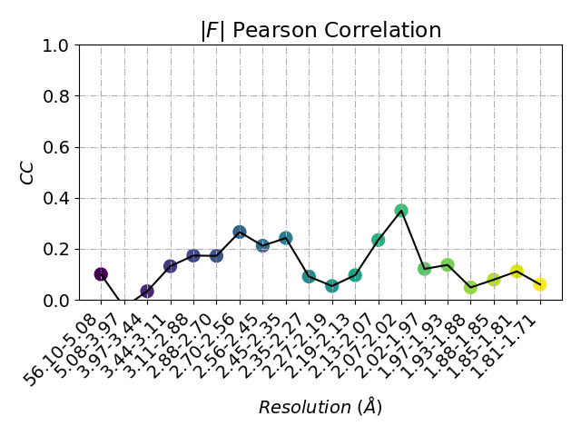
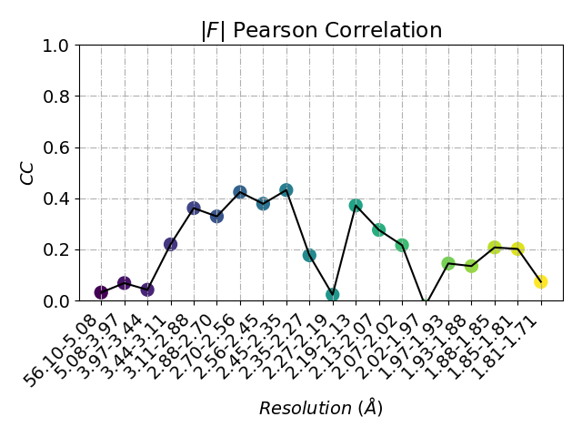
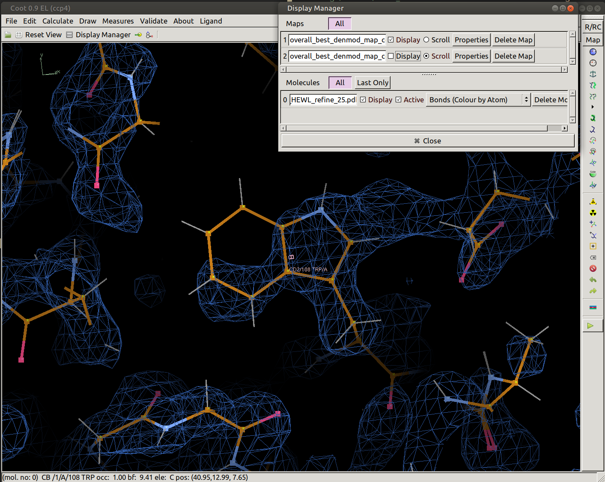
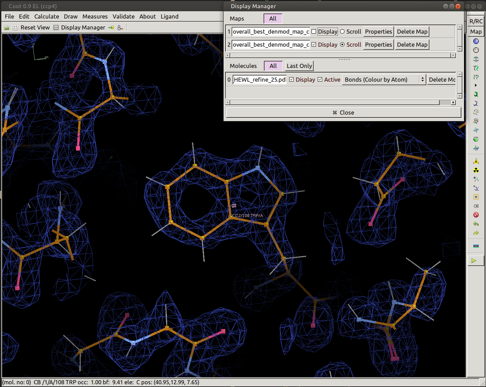

### Robust Merging for Sulfur SAD
This example shows how to process conventional data with `careless`. 
The data set is hen egg white lysozyme room temperature collected at the Advanced Photon Source [beamline 24-ID C](https://necat.chem.cornell.edu/newsite/technical-specifications-24-id-c-beamline).
In total, 1,440 images procesed with [DIALS](https://dials.github.io/) yielded 411,944 reflections which are saved in `careless/examples/hewl_sad`.
These data were collected at low energy, roughly 6.5 keV, and contain substantial sulfur anomalous signal. 
However, there are many outliers in this data set owing to the presence of a shadow on the detector as well as contamination from a higher energy undulator harmonic.



Consequently, these data process much better using a robust error model. 
This example demonstrates the difference in quality of initial phase estimates between a normal and robust error model. 
First enter the `hewl_sad` directory and type `rs.mtzdump unmerged.mtz`.

```
Spacegroup: P43212
Extended Hermann-Mauguin name: P 43 21 2
Unit cell dimensions: 79.331 79.331 37.797 90.000 90.000 90.000

mtz.head():

           BATCH       IPR    SIGIPR  ...         LP         QE  PARTIAL
H   K  L                              ...                               
-18 -3 -1      1  2132.026 28.435514  ... 0.37233505 0.99992234    False
-17 -5 -1      1 1176.6364 21.382341  ... 0.38172576 0.99991775    False
    -4 -1      1  423.9999 12.702219  ... 0.36751527  0.9999155    False
    -3 -1      1  959.0282 18.556822  ... 0.35317278  0.9999137    False
    -2 -1      1 1366.0074  21.63609  ... 0.33865514  0.9999124    False

[5 rows x 14 columns]

mtz.describe():

            BATCH         IPR      SIGIPR  ...         ROT          LP         QE
count  411944.000  411944.000  411944.000  ...  411944.000  411944.000  4.119e+05
mean      720.336     526.871      13.843  ...     359.916       0.620  1.000e+00
std       415.688     768.623       8.308  ...     207.845       0.222  3.908e-05
min         1.000      -6.885       0.160  ...       0.048       0.012  9.998e-01
25%       360.000      63.042       7.491  ...     179.948       0.470  1.000e+00
50%       720.000     217.598      11.822  ...     359.964       0.646  1.000e+00
75%      1081.000     656.902      18.227  ...     540.001       0.796  1.000e+00
max      1440.000   10126.892      66.644  ...     719.949       1.078  1.000e+00

[8 rows x 13 columns]

mtz.dtypes:

BATCH               Batch
IPR             Intensity
SIGIPR             Stddev
I               Intensity
SIGI               Stddev
BG                MTZReal
SIGBG             MTZReal
FRACTIONCALC      MTZReal
XDET              MTZReal
YDET              MTZReal
ROT               MTZReal
LP                MTZReal
QE                MTZReal
PARTIAL              bool
dtype: object
```

These are the default columns from DIALS processing.
There are two intensity columns corresponding to profile fitting and summation. 
By default, the first intensity column will be used exclusively. 
You can switch to a different column with the `--intensity-key` flag. 

### Merging with normally distributed errors
First make an output directory and then call `careless`

```bash
mkdir -p merge/normal
careless mono \
    --sequential-layers=20 \
    --anomalous \
    --iterations=10000 \
    "BATCH,dHKL,Hobs,Kobs,Lobs,XDET,YDET,BG,SIGBG,LP,QE,FRACTIONCALC" \
    unmerged.mtz \
    merge/normal/hewl
```

The `dHKL,Hobs,Kobs,Lobs` metadata keys are automatically generated by `careless` and are always available through the command line app. 
Using a combination of those four keys implies anisotropic scaling. 
To do strictly isotropic scaling, just pass the `dHKL` metadata key.
This should take about 20 minutes to run on modern consumer grade GPU or closer to 5 minutes on an NVIDIA V100.
It will take longer on a cpu. 

After merging, the `merge/normal` will contain several output Mtzs. 
`merge/normal/hewl_0.mtz` contains the full set of merged structure factors. 
The output will also contain two mtz files from merging half datasets, `merge/normal/hewl_half{1,2}_0.mtz`.
To assess data quality, we can have a look at the half data set correlations between these. 
To plot the half data set correlations, type

```bash
ccplot merge/normal/hewl_half1_0.mtz merge/normal/hewl_half2_0.mtz
```

You should see a scatter plot of the half data sets as well as the resolution dependent correlation coefficients.
You can also check out the anomalous differences with:

```bash
ccanom_plot merge/normal/hewl_half1_0.mtz merge/normal/hewl_half2_0.mtz
```



### Merging with t-distributed errors
To merge using a robust error model, all that needs to be done is to add the `--studentt-likelihood-dof` flag when calling careless.
This flag takes a single floating point argument which dictates the "degrees of freedom" of the T-distribution used in the likelihood function. 
This parameter alters the heaviness of the tails of the error model. 
Smaller values make it more tolerant of outliers. 
Larger values make the distribution closer to the normal distribution.
In fact, the limit of the T-distribution as the degrees of freedom approach infinity is the normal distribution.
In practice it is best to learn the proper number of "degrees of freedom" for a particular data set using cross-validation.
That has already been done for this data set, and we know that a value of 16 offers good performance.

```bash
mkdir -p merge/studentt
careless mono \
    --studentt-likelihood-dof=16 \
    --sequential-layers=20 \
    --anomalous \
    --iterations=10000 \
    "BATCH,dHKL,Hobs,Kobs,Lobs,XDET,YDET,BG,SIGBG,LP,QE,FRACTIONCALC" \
    unmerged.mtz \
    merge/studentt/hewl
```

Again, have a look at the `ccanom_plot`
```bash
ccanom_plot merge/studentt/hewl_half1_0.mtz merge/studentt/hewl_half2_0.mtz
```

The signal is notably higher at low resolution. 




### Making experimental maps with AutoSol
In order to demonstrate the impact of robust errors on the experimental phases, we can generate a density modified experimental electron density map using AutoSol from PHENIX.
Using the supplied `.eff` parameter files, run:

```bash
phenix.autosol normal.eff & phenix.autosol studentt.eff
```

To inspect the experimental maps, type

```bash
coot reference_data/RTSAD_HEWL_refine_25.pdb \
    AutoSol_run_1_/overall_best_denmod_map_coeffs.mtz \
    AutoSol_run_2_/overall_best_denmod_map_coeffs.mtz
```

This will load coot with both maps and a reference structure. 
You can switch between them in the display manager. 

| Normally-Distributed Error Model |  T-Distributed Error Model  |
| ------------------------- | --------------------------- |
|||


