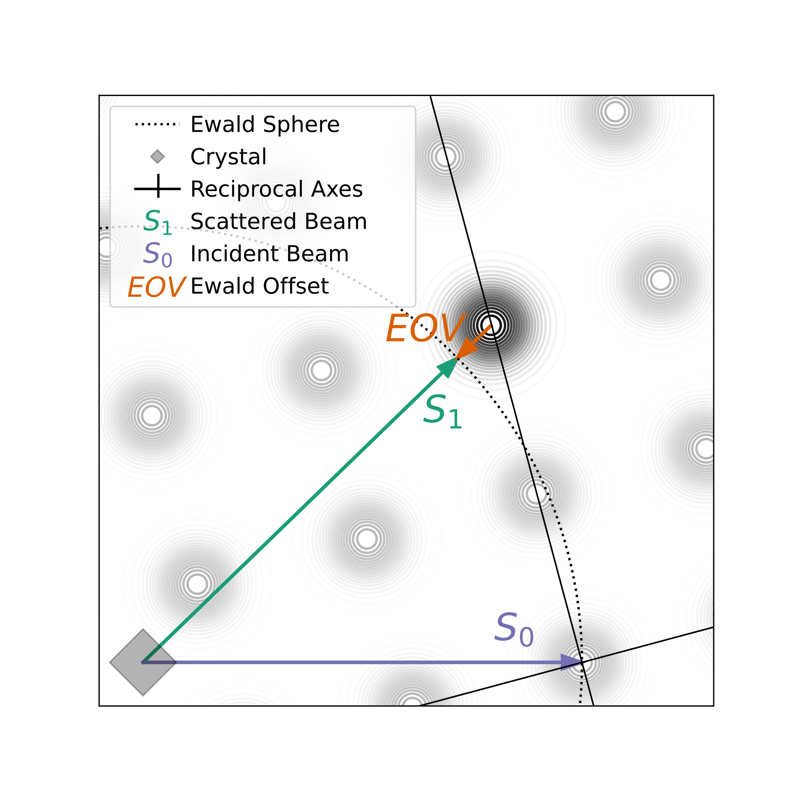
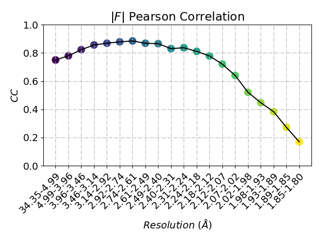
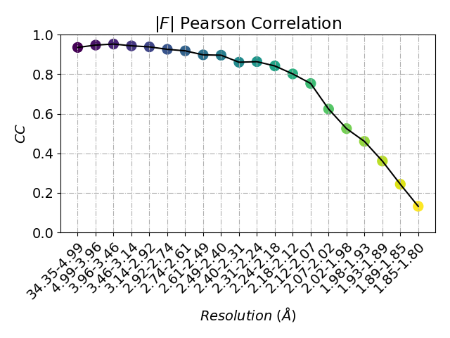
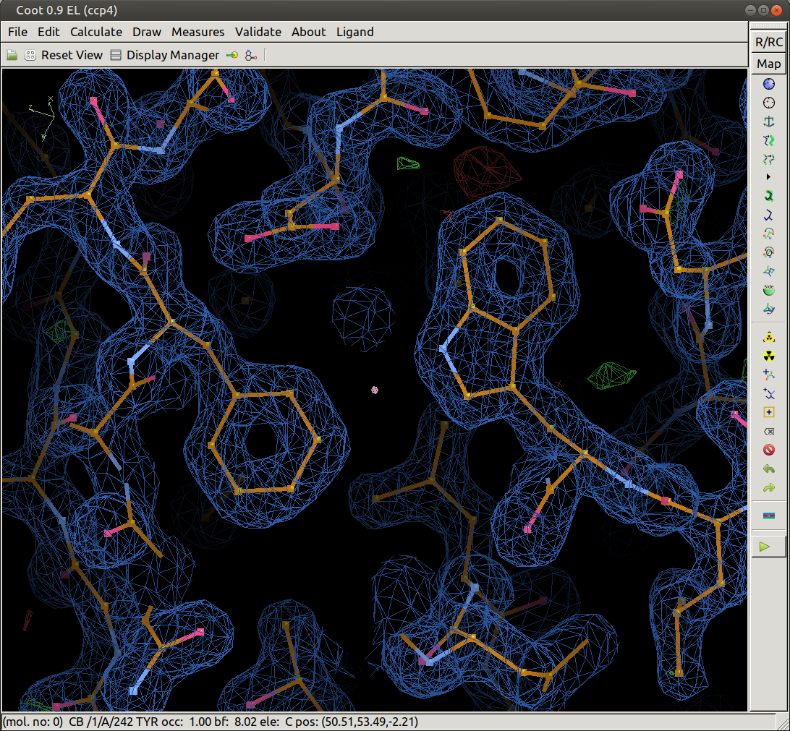
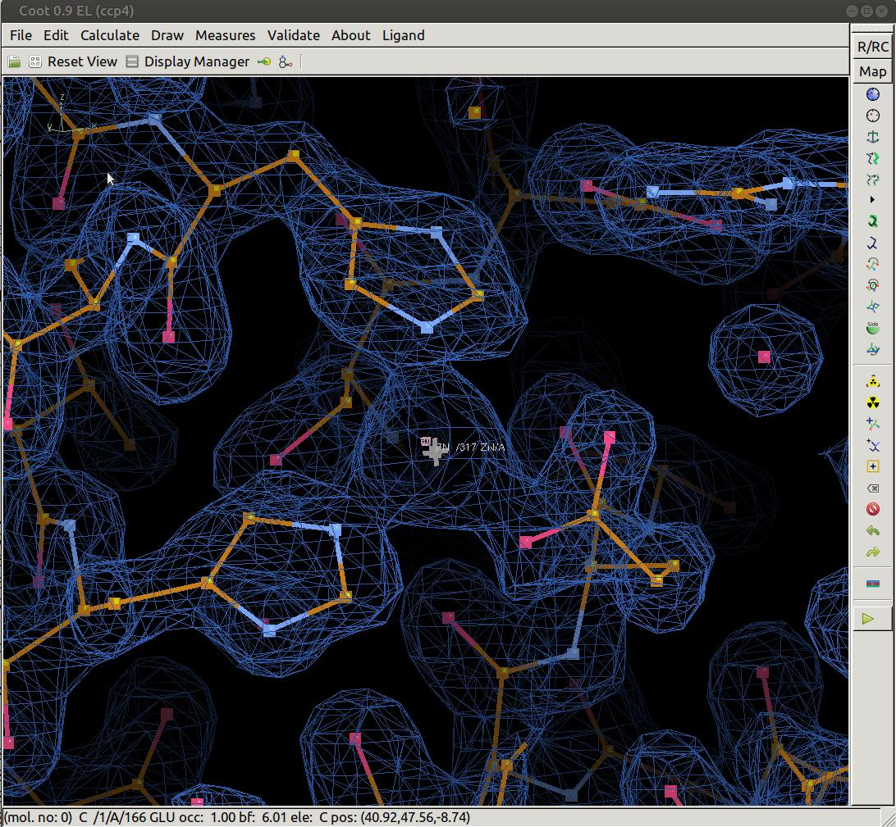

### Merging Serial XFEL Data with Careless

The data in `careless/examples/thermolysin_xfel` are serial crystallography data from thermolysin microcrystals. 
The parent experiment of these data is freely available at the [CXIDB](https://cxidb.org/id-81.html). 
Because the original data set is very large, this example deals with a single run containing 3,160 images.
The unmerged reflections, stored in `careless/examples/thermolysin_xfel/unmerged.mtz` were prepared with a custom `cctbx` [script](../scripts/stills2mtz). 


Enter the thermolysin directory and use [reciprocalspaceship](https://github.com/hekstra-lab/reciprocalspaceship) to explore the contents of this mtz file. 

```bash
cd careless/examples/thermolysin_xfel
rs.mtzdump unmerged.mtz
```
The output will look like this:
```
Spacegroup: P6122                                                                 
Extended Hermann-Mauguin name: P 61 2 2                                           
Unit cell dimensions: 93.239 93.239 130.707 90.000 90.000 120.000                 
                                                                                  
mtz.head():                                                                       
                                                                                  
                  I      SigI  BATCH   ewald_offset       xobs      yobs  PARTIAL 
H   K  L                                                                          
-37 -4 18  100.0531 37.407852      0  0.00012526145  31.259258 28.768877    False 
-35 -4 25 230.70123  33.55069      0  0.00011196301   160.9048    95.035    False 
    -3 19 254.54163 40.807156      0 -3.2544629e-06  106.00912 28.164373    False 
    -2 2  -52.80359  41.45886      0  0.00012509839  106.53387 56.561504    False 
       3  -59.73877 46.124752      0 -7.5770618e-06 108.686714 42.542465    False 
                                                                                  
mtz.describe():                                                                   
                                                                                  
               I       SigI      BATCH  ewald_offset       xobs       yobs        
count  1.098e+06  1.098e+06  1.098e+06     1.098e+06  1.098e+06  1.098e+06        
mean   3.954e+03  7.944e+01  1.617e+03    -6.794e-07  9.823e+01  9.252e+01        
std    9.720e+03  5.429e+01  9.149e+02     2.600e-04  5.418e+01  5.185e+01        
min   -1.978e+04  3.355e-01  0.000e+00    -2.090e-03  5.000e-01  5.000e-01        
25%    1.016e+02  3.794e+01  8.060e+02    -1.438e-04  5.175e+01  4.773e+01        
50%    6.338e+02  6.903e+01  1.664e+03    -6.854e-07  9.881e+01  9.261e+01        
75%    2.970e+03  1.081e+02  2.404e+03     1.427e-04  1.450e+02  1.373e+02        
max    2.081e+05  4.967e+02  3.159e+03     2.099e-03  1.935e+02  1.844e+02        
                                                                                  
mtz.dtypes:                                                                       
                                                                                  
I               Intensity                                                         
SigI               Stddev                                                         
BATCH               Batch                                                         
ewald_offset      MTZReal                                                         
xobs              MTZReal                                                         
yobs              MTZReal                                                         
PARTIAL              bool                                                         
dtype: object                                                                     
```

This mtz has an extra column from the [stills2mtz](../scripts/stills2mtz) script, `Ewald_offset`. 
This contains the magnitude of the Ewald offset vector between the observed reflection centroids and their centroids in reciprocal space. 
These are in a crystal-fixed cartesian [coordinate system](https://dials.github.io/documentation/conventions.html). 
Because we're dealing with still images here, each of the reflections have partial intensities which are dictated by how far away from the ideal Bragg contition they fall. 
The Ewald offset is a way of summarizing how disastified Bragg's law is for a particular reflection observation.

We will achieve the best merging performance with `Careless` if we include this column in the metadata supplied to the scaling model. 
Effectively, this enables the algorithm to learn a reciprocal lattice point model. 
For the sake of comparison, let's first merge the data without the Ewald offsets. 


```bash
mkdir merge #First make an output directory
careless mono \
  --iterations=10000 \
  --image-scale-key=BATCH \
  --dmin=1.8 \
  --anomalous \
  --learning-rate=0.001 \
  "dHKL,BATCH,xobs,yobs" \
  unmerged.mtz \
  merge/thermolysin
```

In this example we use the `--image-scale-key` flag. 
This instructs `Careless` to add a linear scale parameter per image.
In single-crystal experiments, we can reasonably expect the scale to vary smoothly throughout a rotation series. 
However, this is not the case with serial data, because each image originates from a separate crystal with its own inherent scattering power.
We can overcome the intrinsic choppiness in the image scale function by assigning each image a linear scale factor. 
XFEL beam intensities fluctuate much more than synchrotron sources so a per image scale may be warranted even for single-crystal XFEL experiments.
This is an open question for future work on variational merging.
Regardless, it is worth noting that the per image scale factor breaks the global scale parameterization in the default careless implementation. 
Luckily, it is easilly implemented and costs very little in terms of performance.
This example also uses the `--dmin` flag to set the maximum resolution to 1.8 Å which is the published resolution of this data set.
We use the `--anomalous` flag to indicate we would like to merge the Friedel mates separately.

After this is finished running, reapeat the procedure wiht a new base directory and supply the metadata keys for the Ewald offsets `cartesian_delta_{x,y,z}`.

```bash
mkdir merge_eo #eo for Ewald offset
careless mono \
  --iterations=10000 \
  --image-scale-key=BATCH \
  --dmin=1.8 \
  --anomalous \
  --learning-rate=0.001 \
  "dHKL,BATCH,xobs,yobs,ewald_offset" \
  unmerged.mtz \
  merge_eov/thermolysin
```


we can have a look at the half data set correlations and assess the quality of the merging. 
Careless ships with a small script for this. To run it call

```bash
ccplot merge/thermolysin_half1_0.mtz merge/thermolysin_half2_0.mtz
```

for the first results and 
```bash
ccplot merge_eov/thermolysin_half1_0.mtz merge_eov/thermolysin_half2_0.mtz
```
for the second. You will most likely notice that the half data set correlations are much better when ewald offsets are supplied. 


| Without Ewald Offset | With Ewald Offset |
|------------------------------|---------------------------|
| |  |


No we can use the reference structure, [2tli](https://www.rcsb.org/structure/2TLI), to make a map with PHENIX.
There is a refinement script prepared for this. 

```bash
mkdir phenix
phenix.refine refine.eff
```

After PHENIX has finished, you can pull up the electron density map by typing
```
coot phenix/thermolysin_1.pdb phenix/thermolysin_1.mtz
```
This map should look fairly good for low redundancy XFEL data. 



Now have a look at the anomalous difference map from the refined mtz.
You can look this in coot by selecting the ANOM and PHANOM colums. 

